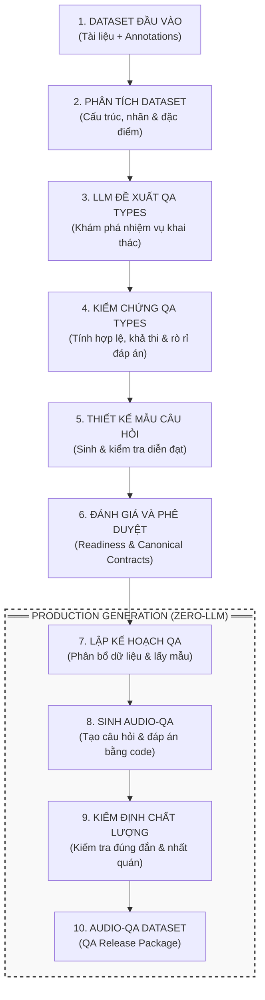

# ĐẶC TẢ KIẾN TRÚC VÀ QUY TRÌNH HỆ THỐNG AUDIO-QA (AUDIO-QA PIPELINE DESCRIPTION)

---

## 1. SƠ ĐỒ QUY TRÌNH TỔNG QUAN

---

## 2. MÔ TẢ CHI TIẾT TỪNG BƯỚC THỰC THI (PHASE-BY-PHASE TECHNICAL SPECIFICATION)

### GIAI ĐOẠN 1: NGHIÊN CỨU & KHÁM PHÁ (R&D / AUTHORING PIPELINE)

#### Bước 1: Dataset Đầu vào (Source Input Artifacts)
- **Đầu vào**:
  - **Dataset Card**: `data_sources/<dataset>/dataset_card.md` (Đặc tả bài toán, tài liệu chính thức).
  - **Dataset README**: `data/<dataset>/README.md` (Thông tin dữ liệu local).
  - **Materialized Annotations**: `data/materialized/<dataset>/train.jsonl` (File nhãn nguồn đã chuẩn hóa).
- **Nguyên tắc**: Tệp âm thanh `.wav` thực tế **KHÔNG** bị mở hay giải mã ở bước này. Dữ liệu âm thanh được đại diện hoàn toàn qua các mã định danh logic (`audio_id`, `audio_path`).

#### Bước 2: Phân tích Dataset (Documentation Ingestion & Dataset Profiling)
- **Thực thi**: `ingest_documentation()` & `profile_dataset()` trong [`src/autonomous_qa/authoring/pipeline.py`](file:///g:/audio_qa_mvp/src/autonomous_qa/authoring/pipeline.py#L221-L352).
- **Hành động**:
  - Đọc và băm SHA256 các tệp tài liệu để đảm bảo tính toàn vẹn (`documentation_manifest.json`).
  - Dùng mã Python thuần để quét file nhãn JSONL, tính toán kiểu dữ liệu (`dtype`), số lượng giá trị rỗng/thiếu, độ phân tán (distinct values), và các phân phối thống kê (`dataset_profile.json`).
- **LLM Calls**: **`0`** (Hoàn toàn bằng Python).

#### Bước 3: LLM Đề xuất QA Types (Semantic Discovery)
- **Thực thi**: `primitive_semantic_discovery` & `composite_discovery` qua [`src/autonomous_qa/authoring/pipeline.py`](file:///g:/audio_qa_mvp/src/autonomous_qa/authoring/pipeline.py#L1003-L1085).
- **Hành động**:
  - Hệ thống sử dụng LLM để khám phá các loại nhiệm vụ Audio-QA có thể xây dựng từ tài liệu và annotation của dataset.
  - Quá trình khám phá gồm hai bước tuần tự:
    - **Primitive Discovery**: LLM đề xuất các nhiệm vụ QA cơ bản, xác định thông tin đầu vào, dạng đáp án và quy tắc suy ra đáp án từ annotation.
    - **Composite Discovery**: Sau khi các Primitive Types được kiểm chứng, LLM đề xuất những nhiệm vụ kết hợp dựa trên các Primitive Types hợp lệ.
  - Mỗi đề xuất được kiểm tra bằng code trước khi chuyển sang giai đoạn tiếp theo. Hệ thống hiện sử dụng cơ chế single-pass proposal and filtering, chưa có vòng lặp tự động sửa những đề xuất không đạt yêu cầu.
- **LLM Calls**: Sử dụng mô hình ngôn ngữ thông qua API tương thích OpenAI để đề xuất Primitive và Composite QA Types, với cấu hình riêng cho từng tác vụ (Primitive Discovery: $T=0.7$, Composite Discovery: $T=0.6$).

#### Bước 4: Kiểm chứng QA Types (Deterministic Python Gating & Leakage Audit)
- **Thực thi**: `gate_primitive_candidate()`, `audit_plan()`, `gate_composite_candidate()`, `deterministic_composite_visibility()`.
- **Hành động**:
  - Các Primitive QA Types được kiểm chứng thông qua **8 deterministic validation gates**:
    1. `SOURCE_SUPPORT`: Trường nhãn có tồn tại trong dữ liệu thực tế.
    2. `GOLD_DERIVABLE`: Đáp án có thể trích xuất tự động từ nhãn nguồn.
    3. `ANSWER_SCHEMA_VALID`: Định dạng đáp án thuộc `field_value`, `boolean`, hoặc `audio_index`.
    4. `OPERATOR_VALID`: Toán tử thuộc `DIRECT`, `TARGET_MATCH`, `EQUALITY`, `PAIRWISE_SELECTION`.
    5. `NO_DIRECT_GOLD_VISIBLE`: Đáp án không bị trực tiếp lộ trong câu hỏi.
    6. `CAPACITY`: Trường nhãn phải có từ 2 giá trị phân biệt trở lên ($N \ge 2$).
    7. `SPLIT_POLICY`: Đúng chính sách chia tập (train/val/test).
    8. `NO_DUPLICATE_PROPOSITION`: Không trùng lặp với dạng câu hỏi khác.
  - Những Composite QA Types được đánh giá riêng bằng **4 validation gates**, bao gồm kiểm tra quan hệ phụ thuộc (`ALL_COMPONENTS_ACCEPTED`, `DEPENDENCIES_EXPLICIT`), tính hợp lệ của các thành phần (`NO_REDUNDANT_COMPONENT`) và nguy cơ rò rỉ đáp án qua kiểm tra suy luận cặp dòng thực tế (`OUTPUT_NOT_VISIBLE_IN_INPUT`).

#### Bước 5: Thiết kế Mẫu câu hỏi (Language Authoring & Preflight)
- **Thực thi**: `language_generation` & `gate_language_entry()` trong [`pipeline.py`](file:///g:/audio_qa_mvp/src/autonomous_qa/authoring/pipeline.py#L1104-L1138).
- **Hành động**:
  - LLM sinh các mẫu câu hỏi tự nhiên (Question Templates) cho các hợp đồng QA Type đã vượt qua bước kiểm thử.
  - Cổng Preflight Python kiểm tra nghiêm ngặt:
    - Cấm tuyệt đối chứa chuỗi lộ đáp án `__GOLD__`.
    - Phủ đủ các vai trò tham số ngữ nghĩa.
    - Cấm trùng lặp cấu trúc đầu câu.

#### Bước 6: Đánh giá và Phê duyệt Semantic Types (Readiness & Contract Promotion)
- **Thực thi**: `reconcile_with_canonical()`, `readiness.json` và cơ chế quản lý canonical contracts.
- **Hành động**:
  - Hệ thống tổng hợp kết quả kiểm chứng của các QA Types, đánh giá mức độ sẵn sàng cho production và đối chiếu những đề xuất mới với semantic catalog hiện có.
  - `reconcile_with_canonical()` chỉ thực hiện đối chiếu và xuất báo cáo (`reconciliation_canonical.json`), không tự động cập nhật semantic catalog.
  - Việc đưa các Semantic Types vào kho tài nguyên chính thức là một bước phê duyệt và đóng băng riêng biệt.
  - Production chỉ sử dụng những Semantic Contracts đã được phê duyệt và lưu trong canonical resources:
    - [`resources/semantics/<dataset>_semantic_catalog.json`](file:///g:/audio_qa_mvp/resources/semantics/vietmdd_semantic_catalog.json)
    - [`resources/language/production_registry.json`](file:///g:/audio_qa_mvp/resources/language/production_registry.json)

---

### GIAI ĐOẠN 2: THỰC THI SẢN XUẤT (PRODUCTION GENERATION — 100% ZERO-LLM)

#### Bước 7: Lập kế hoạch QA (Production Planning & Seed Sampling)
- **Thực thi**: `feasible_semantic_capacity()`, `resolve_budget()`, `SemanticSampler` trong [`src/autonomous_qa/production/production_qa.py`](file:///g:/audio_qa_mvp/src/autonomous_qa/production/production_qa.py#L416-L627).
- **Hành động**:
  - Tính toán sức chứa dữ liệu tối đa khả thi (`capacity`) cho từng dạng câu hỏi.
  - Lập ngân sách (budget) phân bổ số lượng câu hỏi.
  - Lấy mẫu các cặp âm thanh và nhãn nguồn theo cơ chế ngẫu nhiên có hạt giống (Deterministic Seed-based Sampling), kiểm soát tần suất tái sử dụng hàng (`ReuseTracker`).

#### Bước 8: Sinh Audio-QA (Deterministic QA Rendering)
- **Thực thi**: `realize_qa()`, `render_blueprint()`, `bind_target_value()`, `format_answer()`.
- **Hành động**:
  - Mã Python thuần thay thế các biến mục tiêu vào mẫu câu hỏi đã phê duyệt.
  - Chuẩn hóa khoảng trắng, dấu ngoặc kép (`bind_target_value`), và dấu chấm câu cuối (`normalize_target_quote_boundary`).
  - Trích xuất đáp án chuẩn (Gold Answer) trực tiếp từ nhãn nguồn (100% bằng code, không gọi LLM).

#### Bước 9: Kiểm định chất lượng (Quality Audit)
- **Thực thi**: `audit_qa_records()` & `build_distribution_audit()` trong [`tests/regression/qa_audit.py`](file:///g:/audio_qa_mvp/tests/regression/qa_audit.py).
- **Hành động**:
  - Hệ thống thực hiện kiểm định tự động trên các bản ghi QA nhằm xác nhận tính hợp lệ và nhất quán của dữ liệu đầu ra.
  - Các nội dung kiểm tra bao gồm:
    - **Tính hợp lệ của dữ liệu**: Phát hiện trường bắt buộc bị thiếu, giá trị không hợp lệ và mã QA trùng lặp.
    - **Tính đúng đắn của đáp án**: Kiểm tra đáp án theo từng định dạng, bao gồm MCQ và Open-Ended.
    - **Rò rỉ metadata**: Phát hiện một số định danh nguồn (`speakerID`) và thông tin provenance (`.wav`, `province_code`) không được phép xuất hiện trong câu hỏi.
    - **Phân phối dữ liệu**: Thống kê tỷ lệ nhãn, phân bố đáp án và mức độ sử dụng các mẫu câu hỏi.
  - **Giới hạn hiện tại**: Distribution Audit chủ yếu phục vụ thống kê và báo cáo, chưa tự động chặn release vì mất cân bằng nhãn. Hệ thống cũng chưa triển khai bộ phát hiện PII tổng quát cho tên người, số điện thoại, địa chỉ hoặc thông tin định danh cá nhân.

#### Bước 10: Audio-QA Dataset (QA Release Package)
- **Đầu ra**:
  - `qa_model_facing.jsonl`: Tệp dữ liệu QA sạch dành cho huấn luyện/đánh giá mô hình.
  - `qa_internal.jsonl`: Tệp dữ liệu QA chi tiết phục vụ truy xuất nguồn gốc (internal audit trace).
  - `release_manifest.json` & `format_audit.json`: Manifest đóng băng SHA256 và báo cáo kiểm định chất lượng.
- **Thư mục lưu trữ**: `outputs/releases/<dataset>/` hoặc `outputs/evaluation/<dataset>/`.

---

## 3. CÁC NGUYÊN TẮC NỀN TẢNG (CORE ARCHITECTURAL INVARIANTS)

1. **Phân tách Tuyệt đối giữa R&D và Production**:
   - **Giai đoạn R&D (Khám phá)**: Sử dụng LLM để hỗ trợ đề xuất dạng bài và câu chữ, nhưng kết quả bắt buộc phải đi qua các cổng kiểm thử Python thuần.
   - **Giai đoạn Production (Sản xuất)**: **`100% Zero-LLM`**. Toàn bộ quy trình sinh hàng vạn câu hỏi QA được chạy bằng mã Python xác định (Deterministic Code), đảm bảo tốc độ tối đa và chi phí API bằng $0.
2. **Không Derive Đáp án bằng LLM (Gold Standard Grounding)**:
   - Đáp án đúng (Gold Answer) luôn luôn được trích xuất hoặc suy luận bằng luật Python từ nhãn nguồn (Source Annotations). LLM không bao giờ được tự sinh đáp án.
3. **Quản lý âm thanh bằng định danh logic (Logical Audio Identity)**:
   - Trong quá trình R&D và Production QA, hệ thống không yêu cầu đọc hoặc giải mã nội dung vật lý của các file WAV. Mỗi bản ghi âm được tham chiếu thông qua mã định danh logic (`audio_id`) và đường dẫn (`audio_path`).
   - `audio_id` được tạo xác định từ thông tin nhận dạng nguồn, bao gồm dataset, revision và source row ID. Đây không phải mã băm nội dung của file WAV.
   - Cách tổ chức này cho phép quá trình thiết kế và sinh QA hoạt động độc lập với bước xử lý waveform. Các bước downstream như ghép audio hoặc inference vẫn cần truy cập tệp âm thanh thực tế.
4. **Tính xác định và khả năng tái lập (Deterministic & Reproducible Generation)**:
   - Hệ thống sử dụng những thuật toán xác định và cơ chế lấy mẫu có hạt giống ngẫu nhiên (seed) để bảo đảm khả năng tái lập kết quả.
   - Việc tái tạo dữ liệu QA giống nhau đến từng byte yêu cầu cố định các yếu tố ảnh hưởng đến đầu ra, bao gồm dữ liệu annotation, semantic contracts, language resources, cấu hình sampling, seed, phiên bản code và quy tắc sắp xếp/serialization.
   - Hệ thống sử dụng SHA256 và các regression tests để kiểm chứng tính toàn vẹn và khả năng tái lập của những artifact trong phạm vi đã kiểm thử.
